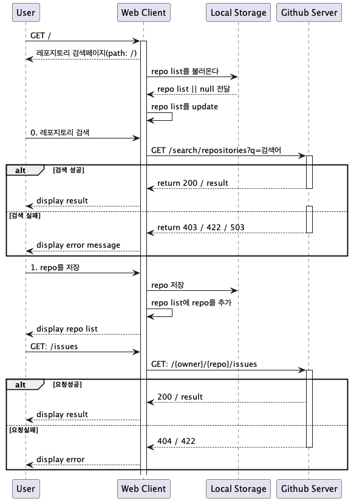
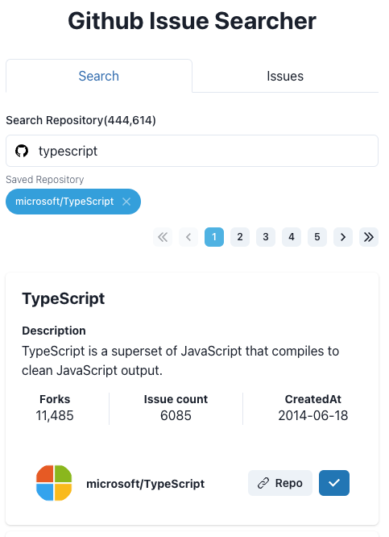
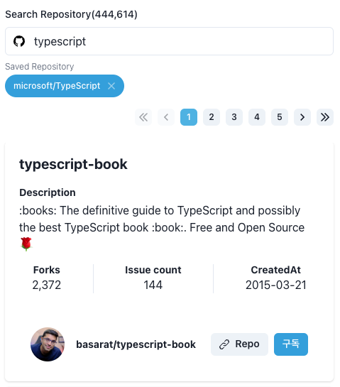
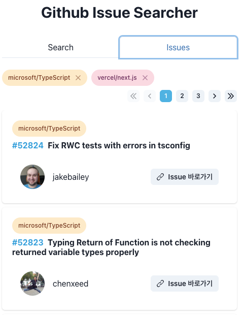
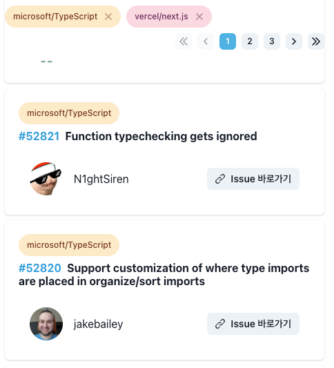

# 프로젝트 설치 & 실행

- vite & SWC를 이용한 프로젝트 셋업
- eslint & prettier (standard) 적용
- husky: pre-commit (npm run lint--fix) 적용

## 설치

`npm install`
`npm run prepare`

## 실행

`npm run dev`

## libraries
- build: Vite4.1.0, SWC
- main: typescript, React 18, react-router-dom@6
- ui: chakra ui
- data fetching: axios
- state management: tanstack-query
- etc: dayjs

# API Reference

[GITHUB - search repository](https://docs.github.com/en/rest/search?apiVersion=2022-11-28)

- unauth 상태에서 최대결과값 1000개
- 분당 호출수 10개 제한

[GITHUB - list repository issues](https://docs.github.com/en/rest/issues/issues?apiVersion=2022-11-28#list-repository-issues)

- owner, repo 필수

# folder structure

- feature 폴더 하위에 기능별로 그룹화된 folder structure를 사용
- 각 하위 폴더는 구성에 따라 component, test, hooks 폴더를 추가 사용해서 확장성 있게 사용
- page 폴더는 router path에 매칭되는 page component의 모음

```
src
├── assets
├── feature
│   ├── common
│   │   ├── axios
│   │   ├── configs
│   │   ├── formatter
│   │   └── utils
│   │       └── test
│   ├── issues
│   │   ├── components
│   │   │   └── test
│   │   └── schema
│   ├── repository
│   │   └── test
│   ├── router
│   ├── search
│   │   ├── components
│   │   └── schema
│   └── ui
│       ├── icons
│       ├── layouts
│       ├── message
│       ├── pagination
│       │   └── test
│       ├── profile
│       └── styles
└── page
```

# Sequence Flow



1. Home Page ('/')
> - 유저는 해당 페이지에 접근하여 검색 기능을 이용해 repository를 query 할 수 있다.
> - 검색된 Public Repository를 등록할 수 있다.
> - 등록 개수는 최대 4개로 제한하며, 최대 개수 초과 등록 시 이를 사용자에게 알려준다.

- public query는 분당 10개의 호출의 한계를 가지므로 debounce를 통해 요청을 지연시킨다.
- 요청이 실패하면 user 에게 UI feedback을 준다.
- 요청이 시작되면 사용자가 입력한 입력값을 search params을 이용해서 기록하여 url 공유, browser history api를 사용할 수 있게 한다.
- 각 응답은 기본적으로 5분의 stale time, 10분의 cache time을 가진다.




2. Issue Page
> 등록된 각각의 Public Repository의 issue를 한 페이지에서 모아서 볼 수 있다.
> - 각 issue 마다 제목, Repository 명은 필수로 표현되어야 한다.
> - 해당 issue를 클릭하면 Github의 상세 페이지로 이동할 수 있다.
> - 페이지네이션을 통해서 계속해서 issue를 모아서 볼 수 있다.



